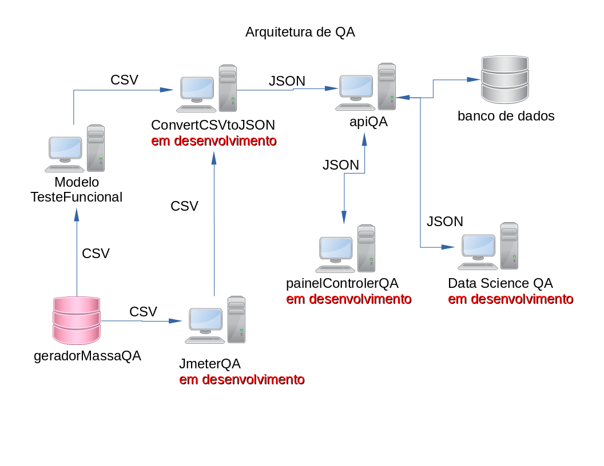

# Gerador massa de dados QA
>  Gerador de massa de dados, faz parte de um projeto de arquitetura de QA.
>  A massa pode ser usado em formulario para cadastra uma pessoa,
>  pode ser usado em teste funcional ou teste usando Jmeter

> __OBSERVACAO__

>  Usando o metodo geradorMassaFake e mais rapido na criacao da massa
>  od que geradorMassaSelenium

> __Ferramenta de desenvolvimento__

> * Python 3
> * Dumper
> * Faker
> * Selenium
> * WebDriver Manager

> __Instalação das Modulos__
> * Instalação do Dumper e Faker 
>  * pip install Dumper
>  * pip install Faker
>       * Doc. Faker
>       * https://faker.readthedocs.io/en/master/

> * Instalção do Selenium
>  * pip install selenium

> * Instalação Webdriver Manager for Python
>  * pip install webdriver_manager
>  * url https://pypi.org/project/webdriver-manager/#
